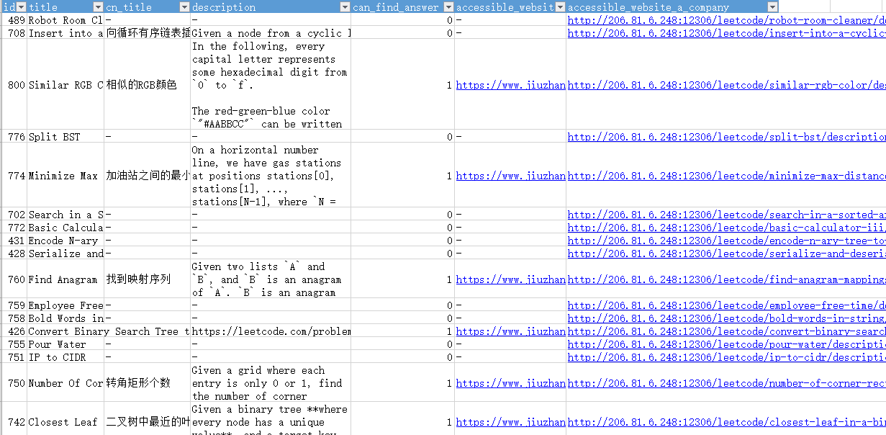

# leetcode_notebook

leetcode 刷题笔记，分知识点记录解决方案，同时提供官网 locked 的题目及解决方案。

欢迎关注个人公众号 ** 可视化技术（visteacher）**，回复 “我要”。

## 加锁题目
加锁的有 163 道（ 2019 年 3 月 10 日），在[九章算法](https://www.jiuzhang.com)里有一些已经有了题目和答案，
而有的只能它的会员查看。

不能直接查看的一些题目在[这个网站](http://206.81.6.248:12306/leetcode/algorithm)上能看到题目，答案看不到。

我总结了一下，放在一个名为 data 文件夹中，后面我会定期更新，然后分享给大家，希望对大家有所帮助。

